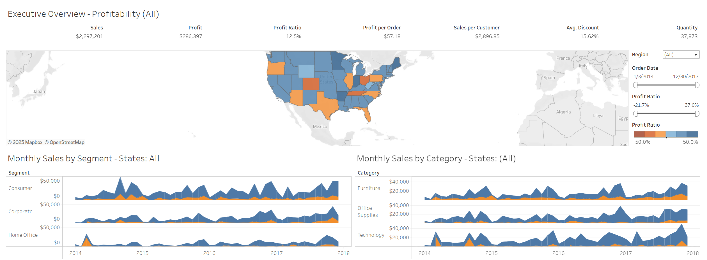

# Superstore_Sales_Dashboard
This Tableau dashboard provides an executive overview of profitability and sales performance across various segments, categories, and regions.

## Introduction

This project provides a comprehensive view of sales and profitability metrics, highlighting key performance indicators across different segments, categories, and regions. The data suggests a balanced distribution of sales across segments and categories, with notable variations in profitability ratios and significant contrasts in total profitability by country.

- **Calculated Fields: Profi per order, profit ratio. Sales per customer.**
- **Data Modeling: Star Schema (*-*).**

## Data Sourcing

It contains 3 tables:

1. ORDERS with 9,995 rows and 21 Columns.
2. RETURNS with 297 rows and 2 Columns.
3. PEOPLE with 5 rows and 2 columns

I connected the Xls file to my Tableau public after cleaning for visualization; I then joined the Orders and Returns table together because of the OrderID column they have in common.

*You can access the dataset [here](https://github.com/Isaiah-99/Superstore_Sales_Dashboard/blob/main/superstore_Cleaned_data.xls)*

## Data Visualization 📉

_You can interact with the Power BI dashboard_ [here](https://public.tableau.com/shared/SF44D7GW4?:display_count=n&:origin=viz_share_link)

# Dashboard Insights 💡
1. The order dates range from 1/3/2014 to 12/9/2017.
2. Sales: Total sales amount to $2,297,201.
3. Profit: The total profit is $596,397.
4. Profit Ratio: The profit ratio is 12.5%, indicating the percentage of sales that turned into profit.
6. Profit per Order: The average profit per order is $57.18.
7. Sales per Customer: The average sales per customer is $2,896.85.
8. Avg. Discount: The average discount offered is 15.82%.
9. Quantity: The total quantity of items sold is 37,973.
10. Monthly Sales by Segment: The sales are evenly distributed across different segments, each contributing $50,000.
11. Monthly sales by category: Sales are also evenly distributed across categories, each contributing $40,000.
12. Profit Ratio by Regions: There are two profit ratios mentioned: 21.7% and 59.0%, indicating varying profitability across different regions or time periods.

## Summary
The dashboard provides an overview of sales and profitability metrics, highlighting key performance indicators across different segments, categories, and regions. Key points include:

- Total Sales: $2,297,201
- Total Profit: $596,397
- Profit Ratio: 12.5%
- Profit per Order: $57.18
- Sales per Customer: $2,896.85
- Average Discount: 15.82%
- Quantity Sold: 37,973

Sales are evenly distributed across segments (Consumer, Corporate, Home Office, Other, Supplies, Technology) and categories (Furniture, Office, Supplies, Technology). However, there are significant variations in profitability ratios (21.7% and 59.0%) and extreme contrasts in country-level profitability (-90.0% and 90.0%).

